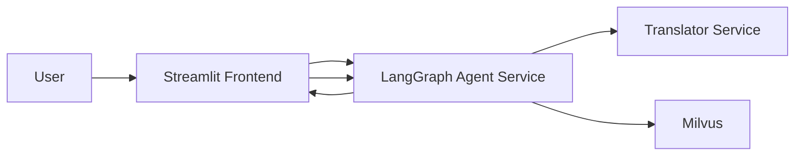

# Option 1: Research Assistant on GKE

Coco Zhang 
AndrewID：yiqingz2

- Streamlit frontend
- LangGraph-based Agent service
- Translator service (FastAPI + googletrans)
- Milvus vector database on GKE
- 30 PDFs already categorized into `AI`, `Security`, `Other`

It follows the deployment roadmap and grading requirements in `Course_Project_Options.pdf`.

## Architecture Diagram



## 1) Project Structure

- `Docker-NLP/`: Translator service
- `agent-service/`: LangGraph orchestration + PDF ingestion + RAG
- `frontend/`: Streamlit UI
- `milvus-gke/`: Existing Terraform for Milvus deployment on GKE
- `infra/k8s/`: K8s manifests for translator/agent/frontend + HPA

## 2) Data/Schema Design

Milvus collection fields:

- `id` (Primary Key)
- `paper_title` (String)
- `domain` (String: `AI` / `Security` / `Other`)
- `language` (String: `en`, `es`, `fr`, `it`)
- `text_chunk` (String)
- `embedding` (FloatVector)

## 3) Important Parsing Rule (No References Indexing)

In `agent-service/app/pdf_utils.py`, the ingestion logic stops parsing once it sees a heading matching:

- `References`
- `Bibliography`

Everything after that heading is discarded before chunking/embedding.

## 4) GKE Deployment Roadmap

### Stage 1: Containerization + Artifact Registry

Build and push three images:

- `translator`
- `agent`
- `frontend`

Procedure:
1) Configure GCP and repository variables
```bash
export PROJECT_ID="your-gcp-project-id"
export REGION="us-central1"
export ZONE="us-central1-a"
export REPO_NAME="option1"
export CLUSTER_NAME="option1-gke"

gcloud auth login
gcloud config set project $PROJECT_ID
gcloud services enable container.googleapis.com artifactregistry.googleapis.com

gcloud artifacts repositories create $REPO_NAME \
  --repository-format=docker \
  --location=$REGION

gcloud auth configure-docker ${REGION}-docker.pkg.dev
```

### Stage 2: Infrastructure + HPA + Internal Services
First upload the entire folder (milvus-gke) to the Google Cloud CLI environment.
1. Deploy Milvus using your existing `milvus-gke/`.
```bash
cd milvus-gke
terraform init
terraform apply -var="project_id=$PROJECT_ID" -var="zone=$ZONE" -var="region=$REGION"

kubectl get svc -n milvus
kubectl get pods -n milvus
```
2. Build and push 3 images
Translator
```bash
docker build -t ${REGION}-docker.pkg.dev/${PROJECT_ID}/${REPO_NAME}/translator:latest Docker-NLP
docker push ${REGION}-docker.pkg.dev/${PROJECT_ID}/${REPO_NAME}/translator:latest
```
Agent
```bash
docker build -t ${REGION}-docker.pkg.dev/${PROJECT_ID}/${REPO_NAME}/agent:latest agent-service
docker push ${REGION}-docker.pkg.dev/${PROJECT_ID}/${REPO_NAME}/agent:latest
```
Streamlit
```bash
docker build -t ${REGION}-docker.pkg.dev/${PROJECT_ID}/${REPO_NAME}/frontend:latest frontend
docker push ${REGION}-docker.pkg.dev/${PROJECT_ID}/${REPO_NAME}/frontend:latest
```

3. Connect to the GKE cluster and deploy the application
```bash
gcloud container clusters get-credentials $CLUSTER_NAME --zone $ZONE --project $PROJECT_ID

cd infra/k8s
kubectl apply -f namespace.yaml
kubectl apply -f configmap.yaml
kubectl apply -f secret.example.yaml
kubectl apply -f milvus-alias-service.yaml
kubectl apply -f translator.yaml
kubectl apply -f agent.yaml
kubectl apply -f frontend.yaml

kubectl get pods -n option1
kubectl get svc -n option1
kubectl get hpa -n option1

kubectl logs -n option1 deploy/translator
kubectl logs -n option1 deploy/agent
kubectl logs -n option1 deploy/frontend
```
4.Test each service individually
Translator
```bash
kubectl port-forward -n option1 svc/translator-svc 8000:8000
```
Use another terminal：
```bash
curl http://127.0.0.1:8000/healthz
curl -X POST http://127.0.0.1:8000/detect-language \
  -H "Content-Type: application/json" \
  -d '{"text":"Hola, como estas?"}'
```
Agent
```bash
kubectl port-forward -n option1 svc/agent-svc 8080:8080
curl http://127.0.0.1:8080/healthz
```
Streamlit
```bash
kubectl get svc -n option1 frontend-svc
```

5. Internal DNS-based access:
   - Translator: `http://translator-svc.option1.svc.cluster.local:8000`
   - Milvus: `milvus-svc.option1.svc.cluster.local:19530` (via `ExternalName` alias)

6. HPA is configured for `translator` and `agent`:
   - min replicas: 1
   - max replicas: 5
   - CPU threshold: 70%

### Stage 3: Limitations and Assumptions

- `googletrans` may occasionally fail due to upstream limitations.
- PDF text extraction quality depends on document formatting.
- Current answer grounding is context-only prompting
- stronger hallucination controls can be added with citation-by-span checks.
- Benchmarks depend on current data volume and cluster resource state.
