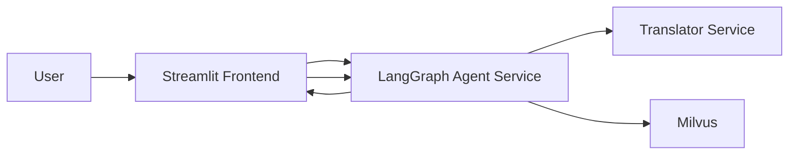

# Option 1: Research Assistant on GKE

Coco Zhang 
AndrewID：yiqingz2

- Streamlit frontend
- LangGraph-based Agent service
- Translator service (FastAPI + googletrans)
- Milvus vector database on GKE
- 30 PDFs already categorized into `AI`, `Security`, `Other`

It follows the deployment roadmap and grading requirements in `Course_Project_Options.pdf`.

## Architecture Diagram



## 1) Project Structure

- `Docker-NLP/`: Translator service
- `agent-service/`: LangGraph orchestration + PDF ingestion + RAG
- `frontend/`: Streamlit UI
- `milvus-gke/`: Existing Terraform for Milvus deployment on GKE
- `infra/k8s/`: K8s manifests for translator/agent/frontend + HPA

## 2) Data/Schema Design

Milvus collection fields:

- `id` (Primary Key)
- `paper_title` (String)
- `domain` (String: `AI` / `Security` / `Other`)
- `language` (String: `en`, `es`, `fr`, `it`)
- `text_chunk` (String)
- `embedding` (FloatVector)

## 3) Important Parsing Rule (No References Indexing)

In `agent-service/app/pdf_utils.py`, the ingestion logic stops parsing once it sees a heading matching:

- `References`
- `Bibliography`

Everything after that heading is discarded before chunking/embedding.

## 4) GKE Deployment Roadmap

### Stage 1: Containerization + Artifact Registry

Build and push three images:

- `translator`
- `agent`
- `frontend`

Example:

```bash
gcloud auth configure-docker us-central1-docker.pkg.dev

docker build -t us-central1-docker.pkg.dev/PROJECT/REPO/translator:latest Docker-NLP
docker build -t us-central1-docker.pkg.dev/PROJECT/REPO/agent:latest agent-service
docker build -t us-central1-docker.pkg.dev/PROJECT/REPO/frontend:latest frontend

docker push us-central1-docker.pkg.dev/PROJECT/REPO/translator:latest
docker push us-central1-docker.pkg.dev/PROJECT/REPO/agent:latest
docker push us-central1-docker.pkg.dev/PROJECT/REPO/frontend:latest
```

### Stage 2: Infrastructure + HPA + Internal Services

1. Deploy Milvus using your existing `milvus-gke/`.
2. Apply manifests in `infra/k8s/`.
3. Ensure internal DNS-based access:
   - Translator: `http://translator-svc.option1.svc.cluster.local:8000`
   - Milvus: `milvus-svc.option1.svc.cluster.local:19530` (via `ExternalName` alias)
4. HPA is configured for `translator` and `agent`:
   - min replicas: 1
   - max replicas: 5
   - CPU threshold: 70%

### Stage 3: Algorithm Experiment and Evaluation

Run benchmark script after indexing papers:

```bash
python scripts/benchmark_indexes.py --output README_INDEX_RESULTS.csv
```

Paste the measured results in the table below:

| Index Type | Index Time (s) | Storage Size (bytes) |
|---|---:|---:|
| IVF_PQ | TBD | TBD |
| DISKANN | TBD | TBD |
| HNSW | TBD | TBD |

All similarity is cosine metric in this implementation.

## 6) Functional Requirements Checklist

- [x] Streamlit paper upload
- [x] Domain selection (AI/Security/Other)
- [x] Multilingual queries (`en`, `es`, `fr`, `it`)
- [x] LangGraph agent as orchestrator
- [x] Translator service via standard API
- [x] Milvus retrieval with domain filter
- [x] Response in same language as query
- [x] Two recommended papers + references
- [x] GKE deploy manifests + HPA
- [x] Reference section excluded from indexed content

## 7) API Summary

### Translator (`Docker-NLP`)

- `GET /healthz`
- `POST /detect-language`
- `POST /translate`

### Agent (`agent-service`)

- `GET /healthz`
- `POST /ingest` (multipart PDF upload + metadata)
- `POST /ask`

## 8) Limitations and Assumptions

- `googletrans` may occasionally fail due to upstream limitations.
- PDF text extraction quality depends on document formatting.
- Current answer grounding is context-only prompting; stronger hallucination controls can be added with citation-by-span checks.
- Benchmarks depend on current data volume and cluster resource state.

